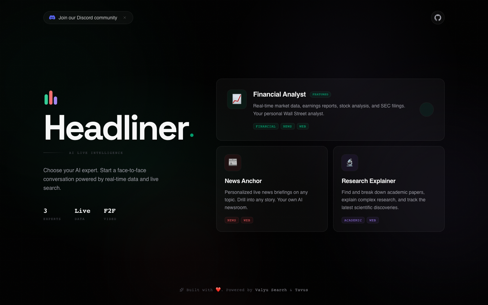
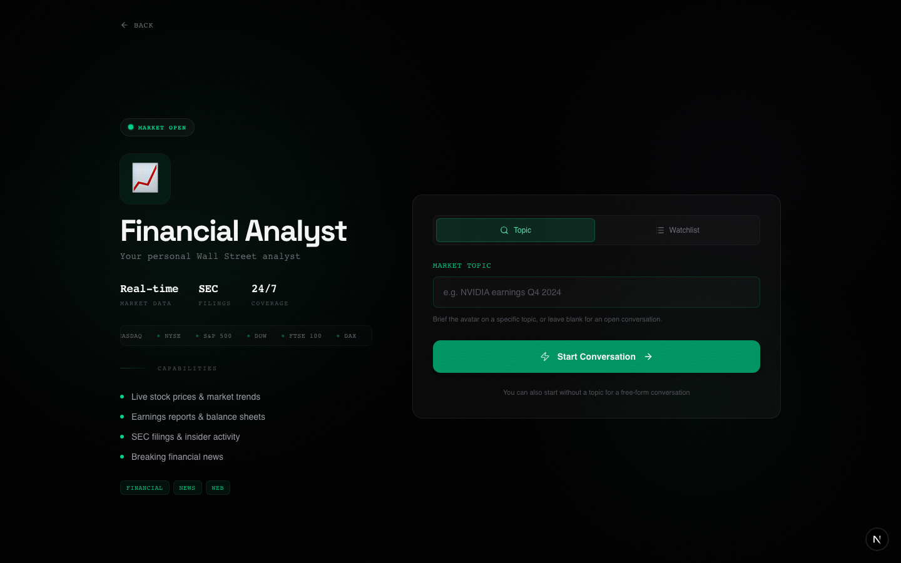
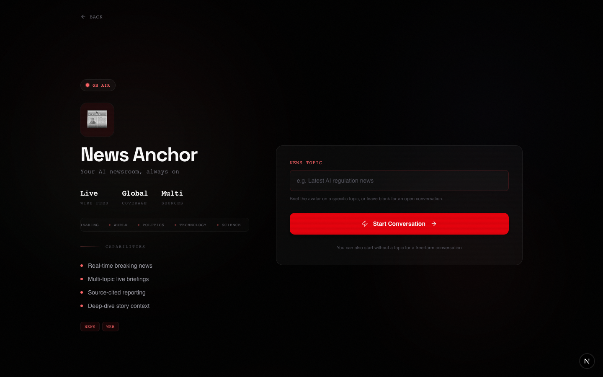
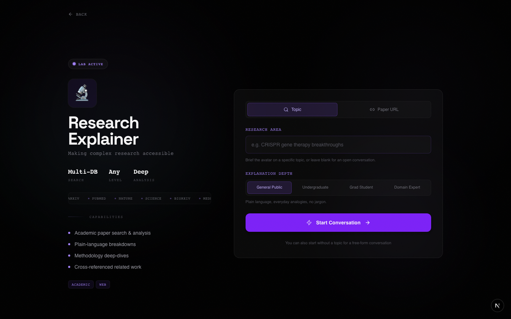

<p align="center">
  
</p>

<h1 align="center">Headliner</h1>

<p align="center">
  Talk face-to-face with AI experts who analyze your portfolio, broadcast your news, and break down your research, all powered by real-time search from <a href="https://valyu.ai">Valyu</a>.
</p>

<p align="center">
  Built with <a href="https://docs.tavus.io">Tavus CVI</a> for conversational video, <a href="https://valyu.ai">Valyu</a> for real-time search, and <a href="https://nextjs.org">Next.js</a>.
</p>

---

## Home



## Personas

<table>
  <tr>
    <td width="33%"><strong>Financial Analyst</strong></td>
    <td width="33%"><strong>News Anchor</strong></td>
    <td width="33%"><strong>Research Explainer</strong></td>
  </tr>
  <tr>
    <td></td>
    <td></td>
    <td></td>
  </tr>
  <tr>
    <td>Real-time market data, earnings reports, stock analysis, SEC filings, and portfolio briefings with watchlist support</td>
    <td>Live news briefings on any topic with source citations and multi-story coverage</td>
    <td>Academic paper breakdowns from arXiv, PubMed, and bioRxiv with adjustable difficulty levels</td>
  </tr>
</table>

## Features

- **3 AI Experts** — Financial Analyst, News Anchor, and Research Explainer, each with a distinct personality and toolset
- **Face-to-Face Video** — Real-time conversational video powered by Tavus CVI and Daily.co WebRTC
- **Live Search** — On-the-fly web, academic, financial, and news search via Valyu
- **Live Data Cards** — Bloomberg-style data overlays that surface key metrics, tickers, and price changes during briefings
- **Video Recording** — Record briefings as `.webm` files directly from the browser (avatar-only or picture-in-picture)
- **Paper Walk-through** — Paste an arXiv/paper URL and get a structured, conversational explanation
- **Watchlist Briefings** — Enter stock tickers for a full portfolio rundown
- **Export Summary** — Download conversation transcripts as text

## Tech Stack

- **Framework:** Next.js 16 (App Router)
- **Video:** Tavus CVI + Daily.co WebRTC
- **Search:** Valyu (web, academic, financial, news)
- **Language:** TypeScript
- **Styling:** Tailwind CSS 4
- **Animation:** Framer Motion
- **Validation:** Zod

## Prerequisites

- Node.js 18+
- A [Tavus API key](https://platform.tavus.io)
- A [Valyu API key](https://platform.valyu.ai)

## Installation

1. **Clone the repo**

   ```bash
   git clone <your-repo-url>
   cd avatar
   ```

2. **Install dependencies**

   ```bash
   npm install
   ```

3. **Set up environment variables**

   ```bash
   cp .env.example .env.local
   ```

   Edit `.env.local` with your API keys:

   ```env
   TAVUS_API_KEY=your_tavus_api_key
   VALYU_API_KEY=your_valyu_api_key
   TAVUS_REPLICA_ID=rfe12d8b9597
   ```

   Optionally assign different avatar faces per persona:

   ```env
   TAVUS_REPLICA_ID_FINANCIAL_ANALYST=your_replica_id
   TAVUS_REPLICA_ID_NEWS_ANCHOR=your_replica_id
   TAVUS_REPLICA_ID_RESEARCH_EXPLAINER=your_replica_id
   ```

4. **Create a persona**

   Start the dev server, then create a persona via the API:

   ```bash
   npm run dev
   ```

   ```bash
   curl -X POST http://localhost:3000/api/persona \
     -H "Content-Type: application/json" \
     -d '{"persona_type": "financial-analyst"}'
   ```

   The app creates personas on-the-fly per conversation, so this step is optional — but useful for testing your API key is working.

5. **Open the app**

   Visit [http://localhost:3000](http://localhost:3000) and pick a persona to start a briefing.

## Scripts

| Command         | Description              |
| --------------- | ------------------------ |
| `npm run dev`   | Start development server |
| `npm run build` | Production build         |
| `npm run start` | Start production server  |
| `npm run lint`  | Run ESLint               |

## Project Structure

```
src/
├── app/
│   ├── api/
│   │   ├── conversation/   # Create/end video conversations
│   │   ├── search/          # Proxy search requests to Valyu
│   │   ├── oauth/           # OAuth token exchange & refresh
│   │   └── persona/         # Persona management
│   ├── auth/                # OAuth callback handler
│   ├── stores/              # Zustand stores (auth, theme)
│   ├── conversation/
│   │   ├── page.tsx         # Video conversation page
│   │   └── setup/           # Persona setup & topic input
│   └── page.tsx             # Landing page
├── components/
│   ├── auth/                # Sign-in modal, user menu
│   ├── cvi/                 # Tavus CVI components & hooks
│   │   ├── components/      # Video UI, record button, device select
│   │   └── hooks/           # Recording, Daily.co integration
│   ├── avatar-conversation.tsx  # Main orchestrator
│   ├── headliner-logo.tsx   # Animated logo component
│   ├── data-cards.tsx       # Live data overlay cards
│   ├── live-chyron.tsx      # Lower-third ticker bar
│   ├── search-results.tsx   # Sidebar search results
│   ├── transcript.tsx       # Live conversation transcript
│   └── export-summary.tsx   # Export transcript as text
└── lib/
    ├── tavus.ts             # Tavus API client
    ├── valyu.ts             # Valyu search + prefetch
    ├── oauth.ts             # OAuth 2.0 + PKCE helpers
    ├── app-mode.ts          # "valyu" vs "self-hosted" mode
    ├── personas.ts          # Persona configs & system prompts
    └── schemas.ts           # Zod validation schemas
```

## How It Works

1. User selects a persona and enters a topic (or paper URL / stock watchlist)
2. The server pre-fetches relevant data from Valyu and injects it as conversational context
3. Tavus creates an AI persona with the context and starts a WebRTC video call via Daily.co
4. The avatar delivers a face-to-face briefing using the pre-loaded data
5. During conversation, the avatar can trigger live searches — results appear as data cards and in the sidebar
6. Users can record the session, export transcripts, or ask follow-up questions

## App Modes

- **Valyu mode** (`NEXT_PUBLIC_APP_MODE=valyu`) — Users sign in via Valyu OAuth. Their own Valyu credits are consumed for searches.
- **Self-hosted mode** (default) — The server-side `VALYU_API_KEY` is used. No login required.

## License

MIT
